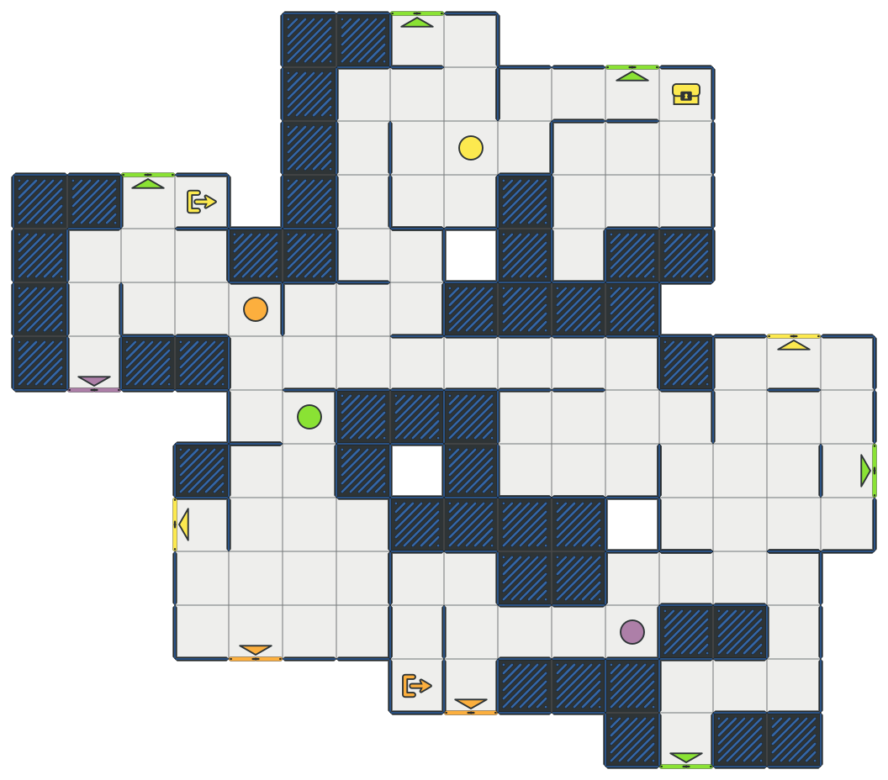
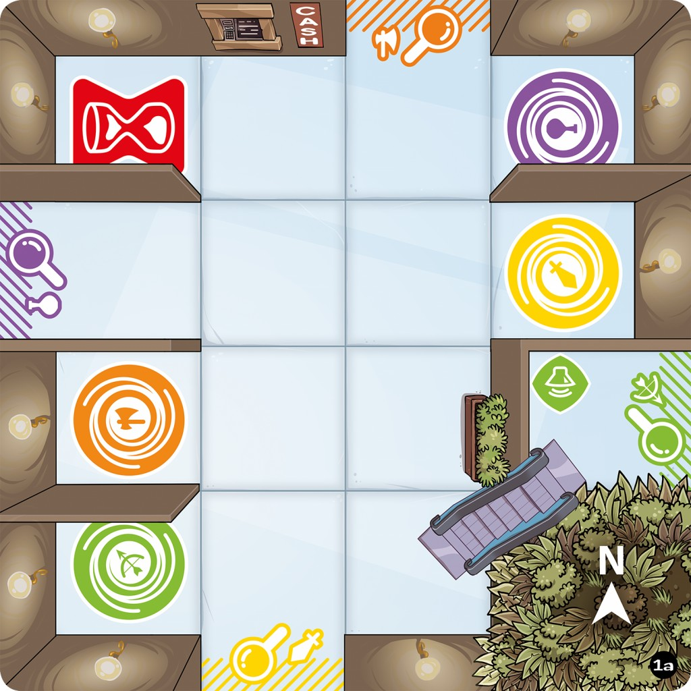
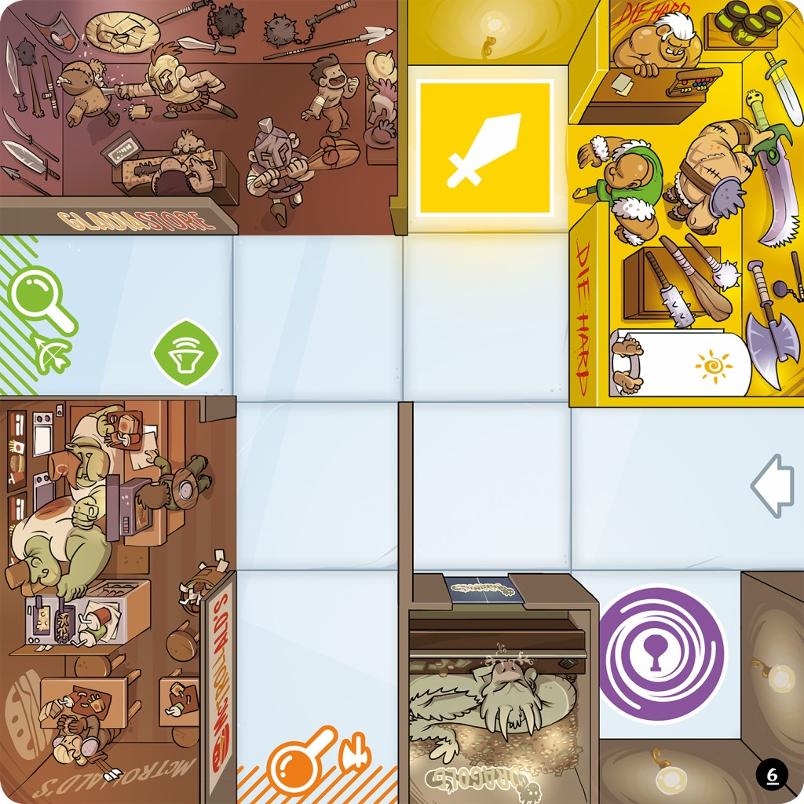
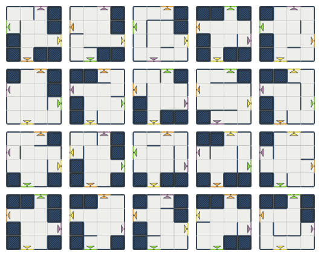

# Projet Magic Maze

code est aussi disponible sur [forge.univ-lyon1](https://forge.univ-lyon1.fr/p1905532/lifap6-projet)
# make commandes 
* make test_tuile 
* make test_tuileCL
* make test_rotation
* make test_graph 

* make test_p <-- ne compile pas >
## Index

1. [Introduction](#introduction)
    * [Objectif](#objectif)
    * [Compétences visées](#compétences-visées)
    * [Réalisation](#réalisation)
1. [Présentation du jeu](#présentation-du-jeu)
    * [Principe du jeu](#principe-du-jeu)
    * [Aventurières](#aventurières)
    * [Tuiles supermarché](#tuiles-supermarché)
    * [Cases spéciales](#cases-spéciales)
    * [Déroulement de la partie](#déroulement-de-la-partie)
1. [Votre travail](#votre-travail)
    * [Génération de tuiles](#génération-de-tuiles)
    * [Plus courts chemins dans une tuile](#plus-court-chemin-dans-une-tuile)
    * [Gestion du supermarché](#gestion-du-supermarché)
    * [Plus courts chemins dans le supermarché](#plus-court-chemin-dans-le-supermarché)
    * [Strategie de base](#stratégie-de-base)
    * [Bonus](#bonus)

<a name="introduction"></a>
## Introduction

[//]: # "{{{"

### Objectif

Le but de ce projet est la réalisation d'un robot automatique pour le jeu
[Magic Maze](https://www.youtube.com/watch?v=yWAwm46h3U0). Magic Maze est un jeu
de société de Kasper Lapp où les joueuses doivent orienter des aventurières dans
un supermarché pour réaliser des objectifs. Votre robot devra donc être en
mesure de calculer à partir d'une situation de jeu les meilleurs coups à jouer.

### Compétences visées

Ce projet vous fera mettre en pratique les algorithmes et structures de données
vus en cours pour résoudre un problème réel. Le projet s'articule autour des
algorithmes d'union find et de recherche de plus courts chemins dans les
graphes. La modélisation du problème ainsi que les algorithmes de plus courts
chemins feront appel à des structures de données étudiées cette année ou les
années précédentes, en particulier des files, parfois à priorité, et
probablement des structures adaptées à des problèmes de type dictionnaire. À
l'issue de ce projet, vous devriez donc être en mesure d'utiliser ces
algorithmes et structures de données pour les problèmes pratiques que vous
pourriez rencontrer dans la suite de votre carrière.

### Réalisation

Vous réaliserez ce projet en binômes. Ce projet sera rendu avant la dernière
séance de TP du semestre. Durant cette dernière séance, les binômes proposeront
une démonstration de leur travail, et auront un petit entretien avec leur
chargé·e de TP pour expliquer leur code, la pertinence des choix de structures
de données, les complexités associées, les difficultés rencontrées, ainsi que
les bugs éventuels.

Votre projet devra être codé en C++. Vous êtes autorisés à utiliser l'ensemble
des fonctionnalités de la bibliothèque standard C++, en particulier les
conteneurs et les algorithmes. Pensez cependant à consulter les complexités de
ces structures et algorithmes pour vous assurer qu'ils sont appropriés au
problème sur lequel ils sont utilisés. Votre code doit être personnel, mais vous
êtes autorisé·es à reprendre du code trouvé en ligne tant qu'il ne s'agit pas
explicitement des solutions complètes des exercices. Ces morceaux de code
devront être **clairement indiqués en commentaires comme repris**, avec le lien
vers les pages sur lesquelles le code a été trouvé, et la licence du code
lorsqu'elle est fournie.

[//]: # "}}}"

## Présentation du jeu

[//]: # "{{{"

### Principe du jeu

Dans le jeu Magic Maze, quatre aventurières commencent au beau milieu d'un
supermarché. Les joueuses devront les déplacer pour petit à petit découvrir de
nouvelles zones du supermarché jusqu'à avoir découvert les objectifs des quatre
aventurières, et les sorties du supermarché. Une fois les objectifs découverts,
les aventurières doivent s'y rendre, puis ressortir du supermarché. Le tout doit
être réussi en temps limité. Toutes les joueuses contrôlent en même temps toutes
les aventurières, mais chaque joueuse ne peut déplacer les aventurières que dans
une seule direction (haut, bas, gauche, droite) qui lui est indiquée en début de
partie. Les joueuses doivent donc se coordonner pour déplacer les pions, mais
n'ont en plus que très rarement le droit de se parler pour se mettre d'accord.

### Aventurières

Les aventurières sont matérialisées par des pions de couleur, placés sur le
plateau de jeu. Leur couleur sert à identifier les éléments du plateau qui leur
correspondent (portes, objectifs, sorties). Les couleurs sont le jaune, le
violet, le vert et le orange.

### Tuiles supermarché

Le supermarché est matérialisé par des tuiles. Une tuile est un carré de 4x4
cases. Les cases peuvent être :

1. des couloirs, par lesquels les aventurières peuvent se déplacer ;
1. des boutiques dans lesquelles les aventurières ne peuvent pas aller.

Sur le bord des tuiles se trouvent des portes pour accéder aux tuiles voisines.
Les portes sont toujours placées aux mêmes endroits, il y en a au maximum quatre.
Chaque porte porte la couleur d'une aventurière (jaune, violet, vert, orange), une
tuile n'aura jamais deux portes de la même couleur. Les portes sont accessibles
via des cases couloir, et les cases couloir sont placées de telle sorte qu'il
soit toujours possible de trouver un chemin pour aller de n'importe quelle case
couloir à n'importe quelle autre.

Lorsqu'une aventurière atteint une case avec une porte, si l'aventurière est de la
même couleur que la porte il est alors possible de découvrir une nouvelle tuile
du supermarché, qui viendra se placer de l'autre côté de la porte. Les tuiles
ont une marque indiquant quelle porte de la nouvelle tuile vient se placer à
côté de la porte utilisée pour la découvrir. Une fois qu'une tuile est placée,
toutes les aventurières peuvent y accéder par n'importe quelle porte (en respectant
les règles de déplacement).

Les nouvelles tuiles sont piochées au hasard, ce qui fait qu'à chaque partie
l'agencement du supermarché est différent.

### Cases spéciales

Pour simplifier les règles du jeu, nous ne considérerons dans un premier temps
que deux cases spéciales (il y en a plus dans le jeu réel):

1. les cases objectif, il y en a une par aventurière pour tout le supermarché, de
  la couleur de l'aventurière ;
1. les cases sorties, il y en a également une par aventurière pour tout le
  supermarché, de la couleur de l'aventurière.

### Déroulement de la partie

En début de partie, une tuile de départ est utilisée. Cette tuile est telle que
les quatre cases centrales sont des couloirs, et les aventurières sont réparties
aléatoirement sur ces quatre cases. Chaque joueuse se voit attribuer une
direction : haut, bas, gauche, droite (le jeu réel donne éventuellement
quelques rôles supplémentaires aux joueuses, mais nous en resterons aux
directions dans un premier temps). Les joueuses jouent tous en même temps et
peuvent déplacer toutes les aventurières dans leur direction. Lors d'un déplacement
dans une direction, l'aventurière peut être déplacée d'autant de cases que
souhaité, tant qu'elle reste sur des cases couloir et ne passe pas par une case
occupée par un autre aventurière.

Les joueuses doivent :

1. trouver les cases objectif de toutes les aventurières, et faire en sorte que
   toutes les aventurières soient en même temps sur leur case objectif.
1. faire sortir toutes les aventurières du supermarché par la case sortie qui leur
   correspond.

Ces objectifs doivent être remplis dans un temps limité. Pour simplifier les
règles, nous considèrerons que le robot automatique doit chercher et utiliser
les chemins les plus courts possibles (en terme de nombre de coups à réaliser)
pour amener les aventurières aux portes de leur couleur et découvrir le
supermarché, puis pour les emmener à leurs objectifs ou leurs sorties.

[//]: # "}}}"

## Votre travail

[//]: # "{{{"

Votre travail consiste à élaborer un robot automatique pour jouer au jeu Magic
Maze. Le robot devra être en mesure de décider pour chaque aventurière, étant
donné une situation de jeu, s'il doit la déplacer ou non, et jusqu'où.

Ce projet s'articule autour de plusieurs sous-parties. Les premières parties
consistent à vous doter d'outils pour modéliser le jeu. Vous étudierez ensuite
comment calculer les déplacements nécessaires pour amener une aventurière à une
position donnée en utilisant le moins de coups possibles.

### Génération de tuiles

[//]: # "{{{"

Pour pouvoir travailler sur le jeu, vous programmerez d'abord un générateur de
tuiles. Ce générateur permettra de générer des tuiles au hasard et vérifier que
vos algorithmes fonctionnent correctement.



#### Dimension des tuiles

Comme indiqué plus haut, une tuile est un carré de 4x4 cases. 
Pour nous faciliter la vie par la suite, nous les numéroterons comme suit :

```cpp
+---+---+---+---+
| 0 | 1 | 2 | 3 |
+---+---+---+---+
| 4 | 5 | 6 | 7 |
+---+---+---+---+
| 8 | 9 | 10| 11|
+---+---+---+---+
| 12| 13| 14| 15|
+---+---+---+---+
```

Des fichier `case.[hc]pp` vous sont fournis pour vous aider à manipuler cette
numérotation. Vous n'êtes cependant pas obligé·es de les utiliser si vous n'en
voyez pas l'utilité. Le principe de cette classe n'est pas de stocker des
données relatives au cases, mais simplement de proposer un ensemble de méthodes
pour facilement accéder aux différents éléments du jeu. La classe ne contient
qu'un entier, et ne prend donc pas plus de place en mémoire qu'un entier, mais
elle permet également d'obtenir les cases voisines, ou de faire la conversion
entre les indices des cases et leurs coordonnées ligne / colonne. Il est donc
déconseillé de modifier cette classe pour y stocker des données supplémentaires.

```cpp
//creation a partir de l'indice
{
  Case c(6) ;
  std::cout << c.ligne() << std::endl ; //1
  std::cout << c.colonne() << std::endl ; //2
}

//creation a partir de ligne et colonne
{
  Case c(1,2) ;
  std::cout << c.index() << std::endl ; // 6
}

//récupération des cases voisines de la case 10
{
  Case c(10) ;
  Case haut = c.haut() ; //utilisation de la méthode dédiée
  Case bas = c.voisine(BAS) ; //utilisation de la méthode générique
  //itération sur les voisins
  for(int i = 0; i < 4, ++i) {
    Case v = c.voisine((Direction) i) ;
  }
}

//test de l'existence d'une case voisine
{
  Case c(11) ;
  try {
    Case droite = c.droite() ; //lance une exception
    //la suite ne sera pas éxécutée
    std::cout << "la case a une voisine droite" << std::endl ;
  } catch (std::exception& e) {
    //on passera par là car c.droite() n'existe pas pour la case 11
    std::cout << "la case n'a pas de voisine droite" << std::endl ;
  }
}
```

#### Types de tuiles

Vous devrez pouvoir créer deux types de tuiles. Une tuile de *départ* est
utilisée pour démarrer la partie. Les pions sont initialement placés sur une
telle tuile, et toutes les tuiles découvertes ensuite sont des tuiles
*classiques*.

* une tuile de départ :

<center>

</center>

* une tuile classique :

<center>

</center>

Ces ilustrations sont tirées du jeu original, illustré par Gyom.

#### Portes

Les portes pour passer de tuile en tuile sont toujours placées aux mêmes
endroits, au niveau des cases 2, 4, 11 et 13. 

Une tuile de départ à toujours quatre portes, une de la couleur de chaque
aventurière. 

Une tuile classique a une porte d'accès qui n'a pas de couleur particulière :
c'est par cette porte qu'on entre sur la tuile pour la première fois lorsqu'on
traverse la porte d'une autre tuile. Cette porte est marquée d'une flèche sur
l'image ci-dessus. Par convention, nous générerons des tuiles classiques avec
cet accès **sur la case 13**. Les trois autres portes ne sont pas nécessairement
utilisées, mais au moins une porte permettra de sortir de la tuile. Si une tuile
classique comporte plusieurs portes, il n'y en aura pas deux de la même couleur.

#### Départ

Sur une tuile de départ les pions commencent sur les quatre cases centrales : 5,
6, 9, 10.

#### Sites

Les *sites* sont des cases particulières sur une tuile. Une porte est un site.
En plus des portes, une case peut être garnie de quelques points d'intérêt.
Comme mentionné plus haut, pour vous simplifier la vie, nous ne considérerons
pour l'instant que les objectifs des aventurières et leurs sorties. Pour la case
de départ, il y aura également quatre sites correspondant aux points de départ
des aventurières.

Pour résumer un site peut être :

* une porte ou un accès
* un objectif
* une sortie
* un point de départ

Le placement des sites est soumis à quelques règles :

* deux sites ne peuvent pas être sur la même case
* il n'y a ni objectif ni sortie sur une tuile de départ
* il n'y a pas plus d'un objectif par tuile
* il n'y a pas plus d'une sortie par tuile
* il n'y a pas à la fois un objectif et une sortie sur une tuile

#### Murs

Entre les cases se trouvent éventuellement des murs. Dans la suite, si nous
avons besoin de numéroter les murs, ils seront numérotés comme suit :

```cpp
+---+---+---+---+
|   12  16  20  |
+ 0 + 1 + 2 + 3 +
|   13  17  21  |
+ 4 + 5 + 6 + 7 +
|   14  18  22  |
+ 8 + 9 + 10+ 11+
|   15  19  23  |
+---+---+---+---+
```

Des fichiers `mur.[hc]pp` vous sont fournis pour vous aider à manipuler ces
indices. De même si vous n'en voyez aucune utilité, vous n'êtes pas obligé de
les utiliser. Comme pour les cases, cette case n'a pas pour but de stocker des
informations, mais seulement de manipuler les indices. Elle vous permet
facilement d'accéder aux cases voisines d'un mur ou aux murs voisins d'une case
:

```cpp
//cases voisines du mur 12
{
  Mur m(12) ;
  Case gauche = m[0] ;
  Case droite = m[1] ;
}

//cases voisines du mur 5
{
  Mur m(5)
  Case haut = m[0] ;
  Case bas = m[1] ;
}


//creation du mur entre les cases 5 et 9
{
  Mur m(Case(5), Case(9)) ;
}

//acces au mur droit de la case 8
{
  Case c(9)
  Mur m(c, c.droite()) ;
}

```

#### Principe de la génération

Pour générer les tuiles, vous commencerez par suivre le principe suivant :

* commencer par déterminer si la tuile est une tuile classique ou de départ ;
* déterminer aléatoirement le nombre, la position et la couleur des portes ;
* ajouter si nécessaire les points de départ ;
* positionner éventuellement un objectif ou une sortie sur une case restante ;
* considérer tous les murs comme en place ;
* briser aléatoirement des murs jusqu'à ce que tous les sites soient reliés.

#### Union-find

Pour abattre les murs de la tuile en respectant les contraintes, vous utiliserez
l'algorithme d'union-find, [présenté dans un autre
TP](https://forge.univ-lyon1.fr/lifap6/tp-union-find-etu). Cet algorithme permet
de gérer un ensemble de classes d'équivalences. Dans notre cas, nous dirons que
deux cases sont équivalentes s'il existe un chemin de l'une à l'autre dans la
tuile. Initialement, vu que tous les murs sont en place, il n'y a aucun chemin
d'une case à une autre. Il y a donc une classe d'équivalence par case, ne
contenant que la case. À chaque mur abattu, s'il n'existait pas de chemin entre
les cases de part et d'autre mur, abattre le mur en crée un. Ainsi les deux
cases sont désormais équivalentes, et leurs classes d'équivalences sont
fusionnées : toutes les cases accessibles depuis la case d'un côté du mur
deviennent accessible pour toutes les cases accessibles depuis la case de
l'autre côté du mur, et vice versa.

Réalisez donc le TP proposé plus haut dans un premier temps pour mettre en place
votre structure d'union find. Dans le TP, le but est de faire en sorte que
toutes les cases soient accessibles. Ici par contre, la contrainte est plus
faible, il s'agit simplement de faire en sorte que tous les sites soient dans la
même classe d'équivalence. Enfin, il n'est pas problématique d'abattre des
murs entre deux cases déjà mutuellement accessibles. Lorsque vous étudiez un
mur, il n'est donc pas nécessaire de faire de vérification sur les cases de part
et d'autre, vous pouvez l'abattre directement.

Pour traiter les murs dans un ordre quelconque, vous pourrez utiliser la classe 
`Melangeur` fournie dans les fichiers `melangeur.[hc]pp` : initialisez un
mélangeur d'entiers, dans lequel vous injectez les entiers de 0 à 23 (tous les
indices de mur possibles). Retirer ensuite les entiers un par un et traitez le
mur correspondant.

<a name="boutiques"></a>
### Boutiques

Une fois tous les sites accessibles, une dernière passe esthétique consiste à
supprimer les impasses qui seront inutiles au jeu, et relier ensemble les cases
des boutiques.

Pour supprimer les impasses, vous pouvez itérer tant qu'il existe une case qui
n'est pas un site et qui n'a qu'un mur adjacent brisé. Cette case est donc le
bout d'une impasse, et nous l'isolons en reconstruisant le mur adjacent brisé. 
Lorsque plus aucune case ne correspond, les impasses sont considérées comme 
éliminées.

Une fois les impasses supprimées, vous pouvez reconstruire les classes
d'équivalence qui ont été faussées par les murs reconstruits. Réinitialisez un
union find avec une classe pour chaque case, et fusionnez les classes des cases
de part et d'autre d'un mur brisé. Ensuite, pour chaque case il est possible de
déterminer si elle est accessible depuis les sites (dans la même classe qu'eux)
ou non. Tout mur qui sépare deux cases qui ne sont pas accessibles depuis les
sites est abattu.

<a name="resultat"></a>
### Résultat

En utilisant les outils d'affichage fournis dans les fichiers `draw.[hc]pp`
devriez pouvoir obtenir des tuiles semblables aux suivantes :

#### Tuiles de départ



#### Tuiles standard


notez ici que la porte grise du bas est l'entrée de la tuile.

<a name="affichage-tuiles"></a>
### Export des tuiles

Pour échanger des tuiles ou des ensembles de tuiles ou l'état d'une partie, vous
pourrez utiliser la format de fichier proposé par les fonctions `save` et `load`
dans le fichier `draw.hpp`. Ces fonctions exportent l'ensemble des données à
afficher sous la forme d'un fichier json :

```json
{
  "tuiles": [
    {
      "position" : [ligne, colonne], //deux entiers
      "murs" : [true, false, ..., true, false], //24 booleens
      "sites" : [0, 32, 0, 51, ... , 0] //16 entiers, voir sites.hpp
    },
    //...
  ],
  "joueurs" : [
    {
      "couleur" : c, //entier dans [1,4]
      "tuile" : [ligne, colonne], //deux entiers
      "position" : p //entier, voir cases.hpp
    },
    //...
  ]
}
```

Pour tester vos plus courts chemins, des ensembles de tuiles pourront vous être
fournis sous ce format.

[//]: # "}}}"

### Plus court chemin dans une tuile

Une fois les tuiles fonctionnelles, vous pouvez commencer à élaborer votre
joueur en cherchant des plus courts chemins au sein d'une tuile : vous pourrez
ainsi déplacer les pions dans une tuile pour rejoindre une case donnée, porte ou
objectif.

#### Nombre de coups

Dans Magic Maze, chaque joueuse est responsable d'une direction. Lorsqu'une joueuse
déplace une aventurière, elle peut la déplacer de plusieurs cases à la fois. Ainsi
nous considérerons que chaque déplacement dans une direction coûte un coup,
quelle que soit la longueur du déplacement.

À partir d'une tuile, vous générerez un graphe comportant un noeud par case.
Chaque nœud aura pour nœuds voisins les noeuds qui peuvent être atteints en un
coup depuis sa case. Chaque arête sera étiquetée par la direction du coup, ainsi
que sa longueur. Vous pourrez ainsi par la suite retrouver les coups à jouer à
partir de la séquence de noeuds du graphe.

À vous d'élaborer votre structure de données pour le graphe, à partir des
structures de données de base que vous connaissez. Vous pourrez vous inspirer de
la structure de données utilisée dans `draw.[hc]pp` pour stocker l'ensemble de
tuiles à afficher.

#### Parcours en largeur

Dans votre graphe, il n'y a pas de notion de poids sur les arêtes : chaque arête
coûte un coup. Étant donné un point de départ et un point d'arrivée, vous pouvez
donc réaliser un simple parcours en largeur pour trouver le chemin le plus court
entre les deux. Implémentez ce parcours en largeur.

### Gestion du supermarché

Une fois les tuiles et les chemins fonctionnels, vous pouvez commencer à gérer
le plateau dans son ensemble. À vous de créer une structure de données pour la
gestion du supermarché dans son ensemble et l'assemblage des tuiles. Il faudra
ici faire attention à ce que les coups joués puissent traverser les portes.

#### Rotation des tuiles

Par défaut, lors de la génération des tuiles, nous avons considéré que l'accès à
une tuile était réalisé via la case 13. Lorsque la porte qui a été ouverte pour
mener à cette nouvelle tuile est la porte de la case 2, tout va bien. Dans les
autres cas il vous faudra faire tourner votre tuile.

Pour vous aider dans la gestion de la rotation des tuiles, les classes `Case` et
`Mur` sont munies d'une méthode pour les faire *tourner*. Selon votre
implémentation d'une tuile, vous pourrez ainsi utiliser ces méthodes pour faire
tourner toute une tuile. Ces fonctions vous fournissent les indices des cases
qui se correspondent après une rotation. Si vous ne voyez pas comment les
utiliser, demandez à votre encadrant·e, et si vous n'avez pas envie de les
utiliser, vous n'y êtes pas obligés.

#### Connexion des graphes

Pour pouvoir rechercher les plus courts chemins globalement dans tout le
supermarché, il vous faudra reconnecter les graphes des tuiles individuelles.
Attention il ne suffit pas de mettre une arête entre les noeuds des cases des
portes : si vous mettez une arête avec un coût de 1, il n'est pas possible en un
seul coup de traverser une porte en ligne droite, l'algorithme considérera qu'il
faut s'arrêter à la porte. À l'inverse, si vous ajoutez une arête de coup 0, il
serait alors possible par exemple de passer de la case 7 à la case 11 en allant
vers le bas, puis de traverser la porte gratuitement lors qu'il y a eu un
changement de direction. Essayez donc de trouver une solution qui permette de
façon pratique de reconnecter les tuiles au fur et à mesure du jeu.

### Plus court chemin dans le supermarché

Lorsque votre graphe total est réalisé, vous pouvez à nouveau calculer les plus
courts chemins via un parcours en largeur. Pour chercher le plus court chemin
d'une case à une autre précisément, vous pouvez passer à l'algorithme A*.

### Stratégie de base

La stratégie de base pour le robot consiste à trouver pour chaque pion
l'objectif le plus proche et à s'y rendre :

* s'il reste des objectifs ou des sorties à trouver, sa porte la plus proche ;
* si tout est trouvé, son objectif ;
* si les objectifs sont remplis sa sortie ;

Une fois le plus court chemin obtenu, s'il commence par la direction du joueur,
il déplace le pion. Attention, lorsque le plus court chemin n'est pas unique, il
pourrait y avoir blocage si deux joueurs ne considèrent pas le même chemin.
Pensez-vous pouvoir résoudre ce problème ?

### Bonus

N'attaquez les bonus que si le reste fonctionne. Ces bonus sont des pistes pour
continuer le travail, si vous en trouvez d'autres, faites vous plaisir.

#### Téléportation

Dans la liste des sites dispobibles, vous trouverez également des vortex. La
joueuse qui dispose du rôle permettant d'utiliser les vortex a la possibilité
(tant que les aventurières n'ont pas commis le vol) de prendre une aventurière
n'importe où et de la téléporter sur un vortex de sa couleur. Du point de vue du
graphe, cette action supplémentaire revient à relier tous les noeuds du graphe
vers les vortex avec un coût 1. Attention par contre, ces arêtes ne sont
utilisables que par les aventurières de la couleur du vortex.

#### Gérer plusieurs aventurières

Nous avons jusqu'à présent omis une règle importante du jeu :  les aventurières
ne peuvent pas se croiser sur la même case. Pensez-vous pouvoir gérer le
problème ?

#### Gestion du temps

Normalement le jeu doit être réalisé en un temps limité. Des sites
supplémentaires "sablier" sont présents sur les tuiles pour permettre de
retourner le sablier. Pensez-vous pouvoir le gérer ?

[//]: # "}}}"
